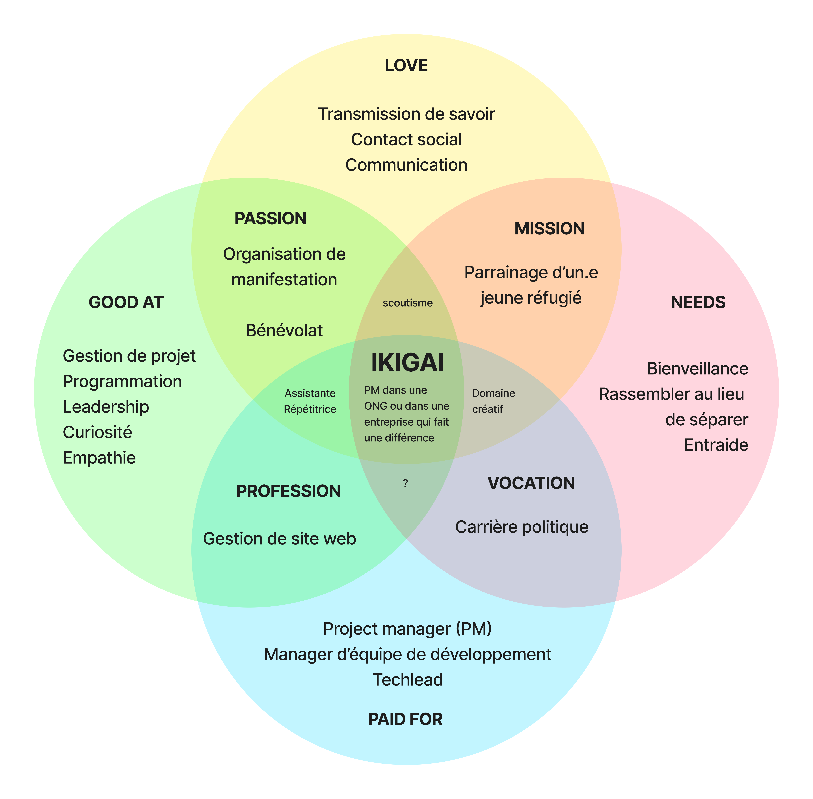

### Fiche du domaine
#### Domaine
Prendre un seul domaine ne semblait pas avoir du sens selon mon Ikigai.

J'ai donc choisi les domaines suivants :
- management / gestion de projet
- développement application
- communication
- projets à fort impact social

#### Mots-clés
- Gouvernance, Gestion émotions, Gestion de projet, Gestion des ressources, leadership
- Applications innovantes, Sites innovants, Javascript, Node.js, Responsive, Technologie web
- Promotion innovante, Communication transverse
- ONG, Associations à impact fort, Domaine à fort potentiel, Impact positif

#### Sous-domaines
- Gestion des ressources humaines, Gestion de la qualité, Gestion des risques, Gestion du budget et des coûts, Gestion temps et délais
- Développement front-end, Développement back-end, Développement mobile, PWA, Développement iOT
- Content Marketing, Communication réseaux sociaux, Publicité en ligne, SEO, SEA, Emailing, Newsletter, Communication IRL
- ONG humanitaires, ONG sociales, ONG environnementales, ONG culturels, Projets à fort impact social

#### Pourquoi ce domaine ?
Depuis toute petite, je dis que je veux changer le monde et le rendre meilleur. J'aimerais vraiment mettre mes compétences au service d'une entreprise ou de projets qui ont un impact positif sur le monde.

J'ai de la facilité à communiquer et à interagir avec des profils différents. J'aime la gestion de projet et j'ai pas mal d'expériences dans le domaine à travers le scoutisme. J'adore être responsable scoute car on réalise à plusieurs les camps et les activités et manage la formation continue à travers des feedbacks. On encadre au début de jeunes responsables et à la fin on a des pros en organisation et en animation. 

Je suis douée en programmation mais j'aimerais aussi pouvoir promouvoir mes projets afin que les autres personnes puissent les voir, adhérer aux valeurs et aux projets et aussi les utiliser s'ils en ont besoin. Je dois donc me renseigner autant dans la programmation que dans la communication online et offline.

J'aimerais que mon métier soit diversifié, impactant et que le monde soit un peu plus beau ou plus accessible à certaines personnes à la fin de chacune de mes journées de travail.

### Mes réseaux sociaux
- [Linkedin](https://www.linkedin.com/in/laurence-kohli/)
- [Portfolio](https://bento.me/laurence-kohli)
- [GitHub](https://github.com/laurenceKohli) 

### Choix du SSG
J'ai choisi le SSG Hugo car il semblait simple et rapide. De plus, le markdown est un langage que je maitrise car j'utilise Obsidian et Notion régulièrement.

Le thème [Lightbi Hugo](https://github.com/binokochumolvarghese/lightbi-hugo) a été choisi car il est responsive et assez simple. Il correspond bien à mon côté cartésien. Je trouve que le thème correspond bien au domaine de la gestion de projet.